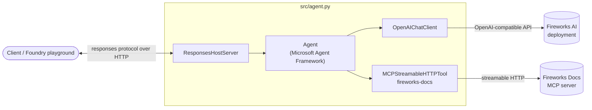
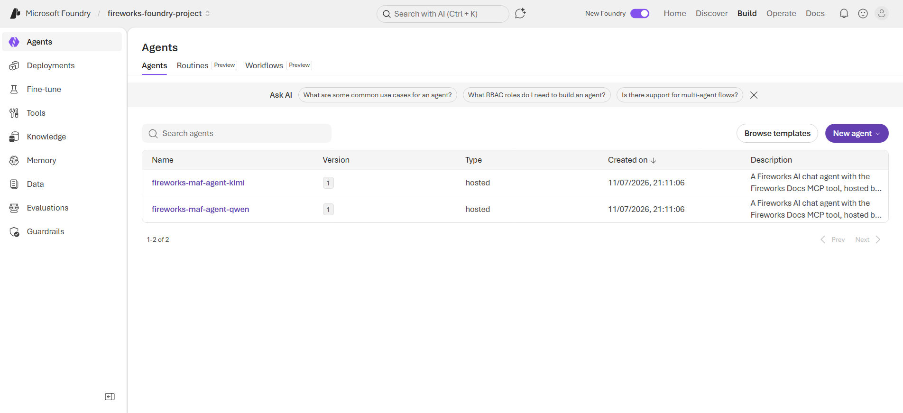
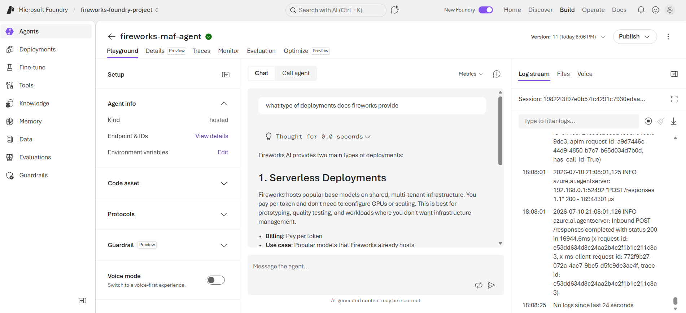

# Fireworks Chat Agent

A **hosted agent** built with the **Microsoft Agent Framework** that runs against a
**Fireworks AI** deployment (via its OpenAI-compatible API) and is augmented with the
**Fireworks Docs MCP** server as a tool.

## Overview

This project wires together three pieces:

- **Microsoft Agent Framework** (`agent-framework-core`) — orchestrates the agent,
  tool calling, and the conversation session.
- **Fireworks AI deployment** — the LLM backing the agent, accessed through the
  OpenAI-compatible endpoint (`https://api.fireworks.ai/inference/v1`).
- **Fireworks Docs MCP server** (`https://docs.fireworks.ai/mcp`) — a streamable
  HTTP [MCP](https://modelcontextprotocol.io) server that lets the agent search the
  full Fireworks AI documentation before answering.

The agent is packaged as a **hosted agent** using the Foundry **responses** protocol.
`src/agent.py` starts a `ResponsesHostServer` that serves the agent over HTTP — the
same contract whether it runs locally or in the cloud. It is **not** a standalone
CLI program; you interact with it through the hosted agent endpoint (for example,
the Foundry playground). When you ask about Fireworks features, APIs, deployments,
or configuration, the agent calls the docs tools to ground its answers in the
official documentation.

## Prerequisites

- **Python 3.10+**
- A **Fireworks AI account** and an **API key**
  ([create one here](https://app.fireworks.ai/settings/users/api-keys))
- Network access to `api.fireworks.ai` and `docs.fireworks.ai`

To run and deploy the agent as a **hosted agent** on Microsoft Foundry you also need:

- **[Azure Developer CLI](https://learn.microsoft.com/azure/developer/azure-developer-cli/install-azd)** (`azd`) 1.25.2 or later
- The **Foundry `azd` extensions** (provide the `azd ai` command group):

  ```bash
  azd ext install microsoft.foundry
  ```

- An **Azure subscription** with the `Contributor` and `Foundry Owner` roles, and
  a signed-in CLI session:

  ```bash
  azd auth login
  ```

## Architecture



**Flow:**

1. A client sends a request to the hosted agent endpoint using the responses
   protocol.
2. The `Agent` sends the conversation to the Fireworks model via `OpenAIChatClient`.
3. If the model decides it needs documentation, it calls a tool exposed by the
   Fireworks Docs MCP server (e.g. `search_fireworks_ai_docs`).
4. Tool results are fed back to the model, which streams the final answer back to
   the client.

Conversation state is kept across turns using an agent session.

## Setup

1. **Create and activate a virtual environment**

   ```bash
   python -m venv .venv
   # Windows (bash)
   source .venv/Scripts/activate
   # macOS / Linux
   source .venv/bin/activate
   ```

2. **Install dependencies**

   ```bash
   pip install -r requirements.txt
   ```

3. **Configure environment variables** in `.env`:

   | Variable             | Description                                              | Default                                              |
   | -------------------- | -------------------------------------------------------- | ---------------------------------------------------- |
   | `FIREWORKS_API_KEY`  | Your Fireworks AI API key (**required**)                 | —                                                    |
   | `FIREWORKS_BASE_URL` | OpenAI-compatible endpoint                               | `https://api.fireworks.ai/inference/v1`              |


   Example `.env`:

   ```properties
   FIREWORKS_API_KEY=fw_your_generated_key_here
   FIREWORKS_BASE_URL=https://api.fireworks.ai/inference/v1
   ```

## Run as a hosted agent (locally)

The agent is packaged as a **hosted agent** using the Foundry **responses**
protocol. `src/agent.py` starts a `ResponsesHostServer` (defined in
`agent-framework-foundry-hosting`), which serves the agent over HTTP — the
same contract used when it runs in the cloud.

Run it locally with the Foundry `azd` extension:

```bash
azd ai agent run
```

This reads `azure.yaml`, installs `requirements.txt`, runs the entry point
(`python src/agent.py`), and starts the agent on <http://localhost:8088>. Your
`.env` values (`FIREWORKS_API_KEY`, `FIREWORKS_MODEL`, `FIREWORKS_BASE_URL`) are
used for the model connection.

Because it speaks the responses protocol over HTTP, interact with it through the
agent endpoint (for example, the Foundry playground or `azd ai agent invoke`) —
not as an interactive terminal program.

> Running locally you may see a one-off `169.254.169.254` (Azure IMDS) connection
> timeout in the logs. It is harmless — that metadata endpoint only exists when
> running on Azure, so the probe simply times out locally.

## Deploy to Microsoft Foundry

Deployment is driven by `azure.yaml`, which describes the hosted agent service
(`host: azure.ai.agent`, `kind: hosted`, `protocol: responses`), its Foundry
project, Python runtime and entry point, resource allocation, and the environment
variables passed to the agent.

1. **Sign in** (if you haven't already):

   ```bash
   azd auth login
   ```

2. **Provision** the supporting infrastructure. This creates the Azure Container
   Registry (ACR) that the agent image is pushed to and sets the
   `AZURE_CONTAINER_REGISTRY_ENDPOINT` value in your azd environment:

   ```bash
   azd provision
   ```

   > **Note:** `azd deploy` only builds and publishes the container image — it
   > assumes the registry already exists. If you run `azd deploy` before
   > provisioning, it fails with
   > `could not determine container registry endpoint`. Run `azd provision`
   > first (or use `azd up` to provision and deploy in one step).

3. **Deploy** the agent (builds the container remotely and publishes it to your
   Foundry project):

   ```bash
   azd deploy
   ```

`azd deploy` uses `remoteBuild` to build the image in Azure, provisions/updates
the hosted agent in the `fireworks-foundry-project`, and injects the
`FIREWORKS_*` variables (from your environment / `.env`) into the running
container. Once complete, the agent is reachable through your Foundry project's
agent endpoint.

> **Tip:** `azd up` runs `azd provision` followed by `azd deploy` in a single
> command — use it for a fresh environment.

## Result

Once deployed, the agents, each for a different base model, are available in the Microsoft Foundry Agents tab:



You can chat with them and watch them call the Fireworks Docs MCP tools:



## Project Structure

```
.
├── .env               # Fireworks credentials & model config
├── azure.yaml         # azd hosted-agent + Foundry deployment config
├── requirements.txt   # Python dependencies
├── docs/
│   └── images/        # Screenshots used in the docs
└── src/
    └── agent.py       # Hosted agent entry point (ResponsesHostServer)
```
