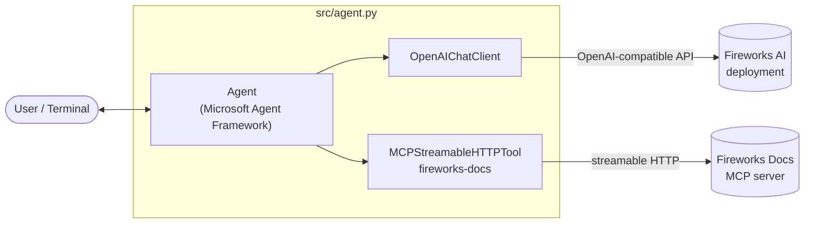

# Fireworks Chat Agent

A simple interactive chat agent built with the **Microsoft Agent Framework** that
runs against a **Fireworks AI** deployment (via its OpenAI-compatible API) and is
augmented with the **Fireworks Docs MCP** server as a tool.

## Overview

This project wires together three pieces:

- **Microsoft Agent Framework** (`agent-framework`) — orchestrates the agent, tool
  calling, and the conversation session.
- **Fireworks AI deployment** — the LLM backing the agent, accessed through the
  OpenAI-compatible endpoint (`https://api.fireworks.ai/inference/v1`).
- **Fireworks Docs MCP server** (`https://docs.fireworks.ai/mcp`) — a streamable
  HTTP [MCP](https://modelcontextprotocol.io) server that lets the agent search the
  full Fireworks AI documentation before answering.

The agent runs as a colorized, streaming command-line chat loop. When you ask about
Fireworks features, APIs, deployments, or configuration, the agent calls the docs
tools to ground its answers in the official documentation.

## Prerequisites

- **Python 3.10+**
- A **Fireworks AI account** and an **API key**
  ([create one here](https://app.fireworks.ai/settings/users/api-keys))
- Network access to `api.fireworks.ai` and `docs.fireworks.ai`

## Architecture



**Flow:**

1. The user types a message in the terminal.
2. The `Agent` sends the conversation to the Fireworks model via `OpenAIChatClient`.
3. If the model decides it needs documentation, it calls a tool exposed by the
   Fireworks Docs MCP server (e.g. `search_fireworks_ai_docs`).
4. Tool results are fed back to the model, which streams the final answer to the
   terminal.

Conversation state is kept across turns using an agent session.

## Setup

1. **Create and activate a virtual environment**

   ```bash
   python -m venv .venv
   # Windows (bash)
   source .venv/Scripts/activate
   # macOS / Linux
   source .venv/bin/activate
   ```

2. **Install dependencies**

   ```bash
   pip install -r requirements.txt
   ```

3. **Configure environment variables** in `.env`:

   | Variable             | Description                                              | Default                                              |
   | -------------------- | -------------------------------------------------------- | ---------------------------------------------------- |
   | `FIREWORKS_API_KEY`  | Your Fireworks AI API key (**required**)                 | —                                                    |
   | `FIREWORKS_BASE_URL` | OpenAI-compatible endpoint                               | `https://api.fireworks.ai/inference/v1`              |
   | `FIREWORKS_MODEL`    | Model id or your deployment                              | `accounts/fireworks/models/llama-v3p3-70b-instruct`  |

   Example `.env`:

   ```properties
   FIREWORKS_API_KEY=fw_your_generated_key_here
   FIREWORKS_BASE_URL=https://api.fireworks.ai/inference/v1
   FIREWORKS_MODEL=accounts/fireworks/models/llama-v3p3-70b-instruct
   ```

## Usage

Run the agent:

```bash
python src/agent.py
```

You'll get an interactive prompt. Your input appears in **cyan** and the agent's
streamed response in **green**. Type `exit` or `quit` (or press `Ctrl+C`) to stop.

Example questions that trigger the docs tools:

- "How do I configure autoscaling for deployments?"
- "What parameters does the chat completions endpoint accept?"
- "Show me examples of function calling with Fireworks models."
- "Find the API reference for batch inference."

## Project Structure

```
.
├── .env               # Fireworks credentials & model config
├── requirements.txt   # Python dependencies
└── src/
    └── agent.py       # Chat agent entry point
```
